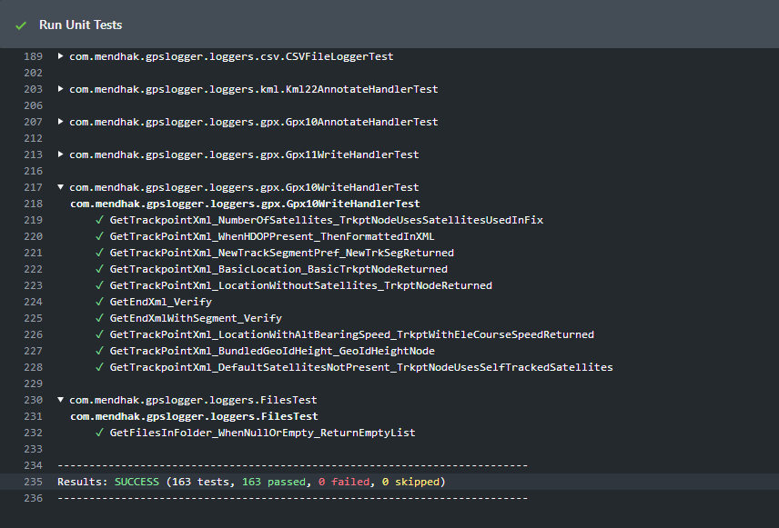

# Github Actions Colored Output with folding (for Gradle tests)

When running Gradle tests on Github Actions, you get very plain looking output.  Github Actions does allow for colors in its output, as well as folding. 

This Gradle script plugin formats the Gradle test output in a slightly colorful way (made for Github Actions, Travis CI and also works in terminal).  It also adds a summary at the end.

## Usage

Add the [ColoredOutput.gradle](ColoredOutput.gradle) to your project, for example at `buildtools/ColoredOutput.gradle`

At the top of your `build.gradle`,

```java
apply from: 'buildtools/ColoredOutput.gradle'
```

If you want Github Actions folding, you can enable it like so:

```java
apply from: 'buildtools/ColoredOutput.gradle'
project.ext.set("GITHUB_ACTIONS_FOLDING", true)
```

Run your gradle tests.  Run your gradle tests on Github Actions. 

### Screenshots

**[Github Actions Color](https://github.com/mendhak/gpslogger/commit/11155ea1e7fdb10bf08af02bba8a837598265321/checks#step:5:234)**



**Terminal**


